```mermaid
graph TB
    You((You))
    F1((Friend))
    S1[🎵 Blues]
    
    You -.50% similar.-> F1
    F1 --> S1
    
    style You fill:#22c55e
    style F1 fill:#3b82f6
    style S1 fill:#f59e0b
```

```mermaid
graph LR
    Start((Start))
    Bad((🚨))
    
    Start -->|attack| Bad
    
    style Start fill:#22c55e
    style Bad fill:#ef4444
```

```mermaid
graph TB
    P0((😷))
    P1((😊))
    P2((😊))
    
    P0 --> P1
    P0 --> P2
    
    style P0 fill:#ef4444
    style P1 fill:#f59e0b
    style P2 fill:#f59e0b
```

<!-- ---
theme: default
background: https://images.unsplash.com/photo-1635070041078-e363dbe005cb?w=1920
class: text-center
highlighter: shiki
lineNumbers: false
info: |
  ## Discrete Mathematics in the Real World
  Exploring fascinating and lesser-known applications
drawings:
  persist: false
transition: slide-left
title: Real-World Applications of Discrete Mathematics
mdc: true
---

# Real-World Applications of Discrete Mathematics

Beyond Theory: Where Discrete Math Powers Our World

<div class="pt-12">
  <span @click="$slidev.nav.next" class="px-2 py-1 rounded cursor-pointer" hover="bg-white bg-opacity-10">
    Press Space for next page <carbon:arrow-right class="inline"/>
  </span>
</div>

---
layout: default
---

# What is Discrete Mathematics?

<v-clicks>

- Mathematics of **countable**, **distinct** objects
- Deals with integers, graphs, statements, and logic
- Opposite of continuous mathematics (calculus, analysis)
- Foundation of computer science and digital systems

</v-clicks>

<div v-click class="mt-8 p-4 bg-blue-500 bg-opacity-10 rounded">
💡 <b>Key Areas:</b> Graph Theory, Combinatorics, Logic, Set Theory, Number Theory, Algorithms
</div>

---
layout: two-cols
---

# Application 1: DNA Sequencing

## Assembling the Puzzle of Life

<v-clicks>

**The Problem:** DNA breaks into millions of tiny pieces

**The Solution:** Connect the overlaps!

Example:
- "HELLO" + "LLOWORLD" = "HELLOWORLD"

</v-clicks>

::right::

<div v-click class="mt-4">


<div class="mt-3 p-3 bg-blue-500 bg-opacity-10 rounded">
<b>🧬 Result: ATGCAT</b>
</div>

<div class="mt-2 p-2 bg-green-500 bg-opacity-10 rounded">
<b>🎯 Impact:</b> Human Genome Project - 3 billion letters!
</div>

</div>

---
layout: two-cols
---

# Application 2: Spotify Recommendations

## How Does Spotify Know Your Taste?

<v-clicks>

**The Math:**
- Find users with similar taste
- Calculate similarity score
- Recommend their favorites!

**Example:**
```
You: {Rock, Jazz, Pop}
Friend: {Rock, Jazz, Blues}
Similarity = 2/4 = 50%
```

</v-clicks>

::right::

<div v-click class="mt-4">



<div class="mt-3 p-2 bg-green-500 bg-opacity-10 rounded">
<b>🎵 Impact:</b> 40% of plays from recommendations!
</div>

</div>

---
layout: default
---

# Application 3: Traffic Lights

## The Coloring Game

<div class="grid grid-cols-2 gap-4">

<div v-click>

**The Problem:**
- 🚗 North-South
- �  East-West  

**Which can go together?**
- N-S and E-W? ❌ Crash!

**The Math:**
- Like coloring a map
- Colors = time slots
- Goal: Fewest colors!

```mermaid
graph TD
    A((🚗 N-S)) ---|conflict| B((🚙 E-W))
    style A fill:#ef4444
    style B fill:#3b82f6
```

</div>

<div v-click>



<div class="mt-3 p-2 bg-blue-500 bg-opacity-10 rounded">
<b>🎨 Solution: 2 Phases</b><br/>
🔴 Phase 1: N-S<br/>
🔵 Phase 2: E-W
</div>

<div class="mt-2 p-2 bg-green-500 bg-opacity-10 rounded">
<b>🌍 Impact:</b> 20-40% less waiting!
</div>

</div>

</div>

---
layout: two-cols
---

# Application 4: QR Codes

## Why Damaged Codes Still Work

<v-clicks>

**The Secret: Backup Data**

Normal: "HELLO"  
With backup: "HELLO" + extra data

</v-clicks>

::right::

<div v-click class="mt-4">

<div class="bg-red-500 bg-opacity-10 p-2 rounded mb-2">
<b>❌ Without:</b> H E ? ? O = Lost!
</div>

<div class="bg-green-500 bg-opacity-10 p-2 rounded mb-3">
<b>✅ With:</b> H E ? ? O + backup = Recovered!
</div>

<div class="p-2 bg-purple-500 bg-opacity-10 rounded">
<b>🎯 Protection:</b> Up to 30% damage OK!
</div>

</div>

---
layout: two-cols
---

# Application 5: Facebook Connections

## Six Degrees of Separation

<v-clicks>

**Amazing Fact:**
Connected to ANYONE through **6 people**!

**On Facebook: Only 3.57!** 🤯

</v-clicks>

::right::

<div v-click class="mt-4">


<div class="mt-3 p-2 bg-blue-500 bg-opacity-10 rounded">
<b>🎯 Bridge connects everyone!</b>
</div>

<div class="mt-2 p-2 bg-purple-500 bg-opacity-10 rounded">
<b>📱 Uses:</b> Find influencers, Suggest friends
</div>

</div>

---
layout: two-cols
---

# Application 6: Protein Folding

## Predicting Molecular Shapes

<v-clicks>

**The Problem:**
- More shapes than atoms in universe! 🤯
- Yet folds in milliseconds

**The Solution:**
Path on a grid - find lowest energy

</v-clicks>

::right::

<div v-click class="mt-4">

```
→ → → ↓
      ↓
← ← ← ↓
```

<div class="mt-3 p-2 bg-green-500 bg-opacity-10 rounded">
<b>🎯 AlphaFold:</b> 90%+ accuracy!<br/>
200M+ proteins predicted
</div>

<div class="mt-2 p-2 bg-yellow-500 bg-opacity-10 rounded">
<b>🏆 Nobel Prize 2024!</b>
</div>

</div>

---
layout: default
---

# Application 7: Airline Scheduling

## Assigning Pilots to Flights

<div class="grid grid-cols-2 gap-4">

<div v-click>

**The Challenge:**
1000 flights/day ✈️

**Rules:**
- 8 hours rest
- Right certifications
- Minimize cost!

</div>

<div v-click>

<div class="p-2 bg-blue-500 bg-opacity-10 rounded mb-2">
<b>Example:</b><br/>
Crew A: Flights 1,2,5<br/>
Crew B: Flights 2,3,4
</div>

<div class="p-2 bg-green-500 bg-opacity-10 rounded">
<b>💰 Savings: $100M+/year</b>
</div>

</div>

</div>

---
layout: two-cols
---

# Application 8: Bitcoin

## Digital Money Math

<v-clicks>

**Hash = Digital Fingerprint**
- "Hello" → "2cf24..."
- "hello" → Totally different!
- Can't reverse it

**Mining = Guessing Game**
Find hash starting with zeros

</v-clicks>

::right::

<div v-click class="mt-4">


<div class="mt-3 p-2 bg-orange-500 bg-opacity-10 rounded">
<b>🔗 Chain:</b> Change one → breaks all!
</div>

<div class="mt-2 p-2 bg-blue-500 bg-opacity-10 rounded">
<b>💰 $1 Trillion market value</b>
</div>

</div>

---
layout: two-cols
---

# Application 9: Faster Programs

## The Compiler's Trick

<v-clicks>

**Problem:** CPU has 4 spots, program has 100 variables!

**Solution:** Reuse spots cleverly

</v-clicks>

::right::

<div v-click class="mt-4">

```python
a = 5    # Spot 1
b = 10   # Spot 2
c = a+b  # Spot 3

d = 20   # Reuse spot 1!
```


<div class="mt-3 p-2 bg-green-500 bg-opacity-10 rounded">
<b>⚡ Result: 2-5x faster!</b>
</div>

</div>

---
layout: two-cols
---

# Application 10: Package Delivery

## The Route Problem

<v-clicks>

**Challenge:** 100 houses

**Possible routes?**
More than atoms in universe! 🤯

**Solution:** Go to nearest house each time

</v-clicks>

::right::

<div v-click class="mt-4">



<div class="mt-3 p-2 bg-red-500 bg-opacity-10 rounded">
<b>📦 UPS: 100M miles saved/year!</b><br/>

```mermaid
graph TB
    Start((🏢))
    H1((🏠))
    H2((🏠))
    
    Start -.1 mi.-> H1
    H1 -.2 mi.-> H2
    
    style Start fill:#22c55e
    style H1 fill:#3b82f6
    style H2 fill:#3b82f6
```

$400M savings
</div>

</div>

---
layout: two-cols
---

# Application 11: Image Compression

## Making Files Smaller

<v-clicks>

**Problem:** Photo = 10 MB

**Solution:** Smart encoding

Instead of:
"Red, Red, Red, Red"

Say: "4 Reds"

</v-clicks>

::right::

<div v-click class="mt-4">

<div class="p-2 bg-gray-500 bg-opacity-10 rounded mb-2">
<b>Normal:</b> A = 8 bits
</div>

<div class="p-2 bg-green-500 bg-opacity-10 rounded mb-3">
<b>Smart:</b> A = 1 bit (if common)
</div>

<div class="p-2 bg-blue-500 bg-opacity-10 rounded">
<b>📊 Result: 6x smaller!</b>
</div>

</div>

---
layout: default
---

# Application 12: Sudoku & Scheduling

## The Logic Puzzle

<div class="grid grid-cols-2 gap-4">

<div v-click>

<div class="text-6xl text-center my-4">
🔢
</div>

**Sudoku Rules:**
- Each row: 1-9
- No repeats!

**Same Math:**
- Class schedules 📚
- Hospital shifts 🏥

</div>

<div v-click>

<div class="p-2 bg-red-500 bg-opacity-10 rounded mb-2">
<b>Rules:</b><br/>
❌ No conflicts
</div>

<div class="p-2 bg-green-500 bg-opacity-10 rounded">
<b>✅ Try until it works!</b>
</div>

</div>

</div>

---
layout: two-cols
---

# Application 13: Network Security

## Catching Hackers

<v-clicks>

**Challenge:** Check millions of packets for attacks 🚨

**Solution:** Check ALL patterns at once!

</v-clicks>

::right::

<div v-click class="mt-4">

<div class="p-2 bg-red-500 bg-opacity-10 rounded mb-2">
<b>❌ Slow:</b> One by one
</div>

<div class="p-2 bg-green-500 bg-opacity-10 rounded mb-3">
<b>✅ Fast:</b> All at once!
</div>



<div class="p-2 bg-cyan-500 bg-opacity-10 rounded">
<b>🛡️ 1M+ packets/second!</b>
</div>

</div>

---
layout: two-cols
---

# Application 14: Music is Math!

## Numbers in Disguise

<v-clicks>

**12 notes = 12 numbers**

Like a clock! 🕐

**Transposing = Adding**
C major {0,4,7} + 2 = D major {2,6,9}

</v-clicks>

::right::

<div v-click class="mt-4">

<div class="text-6xl text-center mb-3">
🎹
</div>

<div class="p-2 bg-blue-500 bg-opacity-10 rounded mb-2">
<b>C Major:</b> Happy! 😊
</div>

<div class="p-2 bg-purple-500 bg-opacity-10 rounded mb-2">
<b>C Minor:</b> Sad! 😢
</div>

<div class="p-2 bg-green-500 bg-opacity-10 rounded">
<b>🤖 AI uses this math!</b>
</div>

</div>

---
layout: two-cols
---

# Application 15: Disease Tracking

## COVID-19 Contact Tracing

<v-clicks>

**Problem:** Who got infected?

**Solution:** Phone tracks contacts 📱

**The Math:** Network of people

</v-clicks>

::right::

<div v-click class="mt-4">



<div class="mt-3 p-2 bg-red-500 bg-opacity-10 rounded">
<b>🔴 Infected → 🟠 Alert contacts!</b>
</div>

<div class="mt-2 p-2 bg-blue-500 bg-opacity-10 rounded">
<b>🦠 Vaccinate super-spreaders first!</b>
</div>

</div>

---
layout: center
class: text-center
---

# 🎯 What We Learned Today

<div class="grid grid-cols-3 gap-4 mt-8">

<div v-click class="p-4 bg-blue-500 bg-opacity-10 rounded">
<div class="text-4xl mb-2">🧬</div>
<b>Biology</b><br/>
DNA sequencing<br/>
Protein folding
</div>

<div v-click class="p-4 bg-green-500 bg-opacity-10 rounded">
<div class="text-4xl mb-2">🎵</div>
<b>Entertainment</b><br/>
Spotify<br/>
Music theory
</div>

<div v-click class="p-4 bg-purple-500 bg-opacity-10 rounded">
<div class="text-4xl mb-2">🚦</div>
<b>Transportation</b><br/>
Traffic lights<br/>
Package delivery
</div>

<div v-click class="p-4 bg-orange-500 bg-opacity-10 rounded">
<div class="text-4xl mb-2">💰</div>
<b>Finance</b><br/>
Blockchain<br/>
Cryptocurrency
</div>

<div v-click class="p-4 bg-red-500 bg-opacity-10 rounded">
<div class="text-4xl mb-2">🛡️</div>
<b>Security</b><br/>
QR codes<br/>
Firewalls
</div>

<div v-click class="p-4 bg-cyan-500 bg-opacity-10 rounded">
<div class="text-4xl mb-2">💻</div>
<b>Computing</b><br/>
Compilers<br/>
Compression
</div>

</div>

<div v-click class="mt-8 text-2xl">
<b>Discrete Math is EVERYWHERE!</b> 🌍
</div>

---
layout: two-cols
---

# 🚀 The Future is Discrete!

<v-clicks>

**What's Next?**

🧬 **Quantum Computing**
- Qubits = discrete states
- New algorithms needed

🤖 **AI Revolution**
- Graph neural networks
- Discrete optimization

� **Web3 & Crypto**
- Advanced cryptography
- Decentralized systems

🧠 **Brain-Computer Interfaces**
- Neural signal processing
- Discrete patterns

</v-clicks>

::right::

<div v-click class="mt-8">

**Career Opportunities:**

<div class="p-3 bg-blue-500 bg-opacity-10 rounded mb-2">
💼 <b>Software Engineer</b><br/>
Algorithms & data structures
</div>

<div class="p-3 bg-green-500 bg-opacity-10 rounded mb-2">
📊 <b>Data Scientist</b><br/>
Graph analysis & optimization
</div>

<div class="p-3 bg-purple-500 bg-opacity-10 rounded mb-2">
🔒 <b>Cybersecurity</b><br/>
Cryptography & pattern matching
</div>

<div class="p-3 bg-orange-500 bg-opacity-10 rounded mb-2">
🧬 <b>Bioinformatics</b><br/>
DNA sequencing & analysis
</div>

<div class="p-3 bg-red-500 bg-opacity-10 rounded">
🤖 <b>AI/ML Engineer</b><br/>
Neural networks & optimization
</div>

</div>

---
layout: center
class: text-center
---

# 🎉 Thank You!

<div class="text-6xl my-8">
🧮 ➡️ 🌍
</div>

<div class="text-2xl mb-8">
<b>Discrete Mathematics: Where Theory Meets Reality</b>
</div>

<v-clicks>

<div class="text-xl mb-4">
💡 Remember: Math isn't just numbers on paper
</div>

<div class="text-xl mb-4">
🚀 It powers the technology you use every day!
</div>

<div class="text-xl mb-8">
🌟 From DNA to Bitcoin, from Spotify to Traffic Lights
</div>

</v-clicks>

<div v-click class="text-3xl font-bold mt-8">
Questions? 🤔
</div>

<div class="mt-8 text-sm opacity-50">
Press <kbd>Esc</kbd> for overview • <kbd>→</kbd> / <kbd>←</kbd> to navigate
</div> -->
