# Real-World Applications of Discrete Mathematics

Beyond Theory: Where Discrete Math Powers Our World

<div class="pt-12 grid grid-cols-2 gap-8">
  <div class="text-left">
    <div class="text-xl mb-4">
      <b>Presented to:</b>
    </div>
    <div class="text-lg">
      Prof. Vijay Kumar Vyas
    </div>
  </div>
  <div class="text-left">
    <div class="text-xl mb-4">
      <b>Presented by:</b>
    </div>
    <div class="text-lg">
      Akshay Kumar Sharma<br/>
      Devansh Singh Rajawat<br/>
      Akshat Sharma<br/>
      Abhimanu Chaturvedi
    </div>
  </div>
</div>

---
layout: default
---

# What is Discrete Mathematics?

<v-clicks>

- Mathematics of **countable**, **distinct** objects
- Deals with integers, graphs, statements, and logic
- Opposite of continuous mathematics (calculus, analysis)
- Foundation of computer science and digital systems

</v-clicks>

<div v-click class="mt-8 p-4 bg-blue-500 bg-opacity-10 rounded">
💡 <b>Key Areas:</b> Graph Theory, Combinatorics, Logic, Set Theory, Number Theory, Algorithms
</div>

---
layout: two-cols
---

# 1. DNA Sequencing

<div class="text-sm">

## The Problem

<v-clicks>

**The Challenge:**
- DNA machines read only 100-300 letters at a time
- Human genome has 3 billion letters!
- Need to reconstruct the original sequence

**Analogy:**
```
Piece 1: "...once upon a ti..."
Piece 2: "...a time there..."
Piece 3: "...there was a..."
```
Find which pieces overlap!

</v-clicks>

</div>

::right::

<div v-click class="mt-2">

<div class="text-sm">

**Why This is Hard:**

<div class="p-2 bg-red-500 bg-opacity-10 rounded mb-2 text-xs">
<b>❌ Brute Force:</b> Try all arrangements<br/>
Time: Billions of years<br/>
For 1000 fragments: 1000! possible orders
</div>

<div class="p-2 bg-green-500 bg-opacity-10 rounded mb-2 text-xs">
<b>✅ Graph Theory:</b> Find overlaps<br/>
Time: Hours to days<br/>
Uses Eulerian Path algorithm
</div>

<div class="p-2 bg-blue-500 bg-opacity-10 rounded mb-2 text-xs">
<b>📊 Scale:</b><br/>
• 3 billion letters in human genome<br/>
• 30 million fragments to assemble<br/>
• Each fragment: 100-300 letters
</div>

<div class="p-2 bg-purple-500 bg-opacity-10 rounded text-xs">
<b>💡 Key Insight:</b> Focus on overlaps, not all arrangements!
</div>

</div>

</div>

---
layout: two-cols
---

# 1. DNA Sequencing

<div class="text-sm">

## The Solution

<v-clicks>

**Example:**
```
"HELLO" + "LLOWORLD"
Overlap: "LLO"
Result: "HELLOWORLD"
```

**DNA Example:**
```
"ATGC" + "TGCA" + "GCAT"
Result: "ATGCAT"
```

</v-clicks>

</div>

::right::

<div v-click class="mt-2">

<div class="text-sm">

**How It Works:**


<div class="mt-2 p-2 bg-blue-500 bg-opacity-10 rounded text-xs">
<b>Step by Step:</b><br/>
1. ATG overlaps with TGC at "TG"<br/>
2. TGC overlaps with GCA at "GC"<br/>
3. GCA overlaps with CAT at "CA"<br/>
Result: ATGCAT
</div>

<div class="mt-2 p-2 bg-green-500 bg-opacity-10 rounded text-xs">
<b>🎯 Real Impact:</b><br/>
• Cost: $100M → $1K per genome<br/>
• Time: 13 years → 1 day<br/>
• Enables personalized medicine
</div>

</div>

</div>

---
layout: two-cols
---

# 2. Spotify Recommendations

<div class="text-sm">

## The Problem

<v-clicks>

**The Challenge:**
- 100M songs, 500M users
- How to find songs you'll love?

**Old Way:**
- Match by genre only
- Problem: "Rock" is too broad!

**Better Way:**
- Find users with similar taste
- Recommend their favorites

</v-clicks>

</div>

::right::

<div v-click class="mt-2">

<div class="text-sm">

**Why Old Methods Fail:**

<div class="p-2 bg-red-500 bg-opacity-10 rounded mb-2 text-xs">
<b>❌ Genre Only:</b> Too broad<br/>
"Rock" includes Beatles to Metallica<br/>
Very different styles!
</div>

<div class="p-2 bg-yellow-500 bg-opacity-10 rounded mb-2 text-xs">
<b>⚠️ Random:</b> Wastes time<br/>
Users skip 90% of random songs
</div>

<div class="p-2 bg-green-500 bg-opacity-10 rounded mb-2 text-xs">
<b>✅ Similar Users:</b> Works great!<br/>
If you both like 5 songs,<br/>
likely to like each other's favorites
</div>

<div class="p-2 bg-blue-500 bg-opacity-10 rounded text-xs">
<b>📊 Scale:</b><br/>
• 500 million users<br/>
• 100 million songs<br/>
• Billions of listening events/day
</div>

</div>

</div>

---
layout: two-cols
---

# 2. Spotify Recommendations

<div class="text-sm">

## The Solution

<v-clicks>

**Formula:**
```
Similarity = Shared / Total Unique
```

**Example:**
```
You: {Rock, Jazz, Pop}
Friend: {Rock, Jazz, Blues}
Shared: {Rock, Jazz} = 2
Total: 4 unique songs
Similarity = 2/4 = 50%
```

**Recommendation:**
- Friend likes Blues
- You haven't heard it
- Recommend Blues to you!

</v-clicks>

</div>

::right::

<div v-click class="mt-2">

<div class="text-sm">

**Visual Network:**

```mermaid
graph TB
    You((You))
    F1((Friend<br/>50%))
    S1[🎵 Blues]
    
    You --> F1
    F1 --> S1
    
    style You fill:#22c55e
    style F1 fill:#3b82f6
    style S1 fill:#f59e0b
```



<div class="mt-2 p-2 bg-blue-500 bg-opacity-10 rounded text-xs">
<b>How It Works:</b><br/>
1. Find users with 40%+ similarity<br/>
2. Look at their favorite songs<br/>
3. Recommend songs you haven't heard
</div>

<div class="mt-2 p-2 bg-green-500 bg-opacity-10 rounded text-xs">
<b>🎵 Real Impact:</b><br/>
• 40% of all plays from recommendations<br/>
• Discover Weekly: 40M active users<br/>
• Processes billions of comparisons/sec
</div>

</div>

</div>


---
layout: two-cols
---

# 3. Image Compression

<div class="text-sm">

## The Problem

<v-clicks>

**The Challenge:**
- Phone photo: 10-20 MB
- Sending takes forever
- Storage fills up quickly

**Why So Big?**
```
4000×3000 pixels = 12M pixels
Each pixel = 3 bytes (RGB)
Total: 36 MB!
```

**Solution:**
- Find patterns
- Store patterns, not pixels

</v-clicks>

</div>

::right::

<div v-click class="mt-2">

<div class="text-sm">

**The Problem:**

<div class="p-2 bg-red-500 bg-opacity-10 rounded mb-2 text-xs">
<b>❌ Store Each Pixel:</b><br/>
36 MB per photo<br/>
100 photos = 3.6 GB!<br/>
Takes minutes to send
</div>

<div class="p-2 bg-green-500 bg-opacity-10 rounded mb-2 text-xs">
<b>✅ Smart Compression:</b><br/>
3-4 MB per photo<br/>
100 photos = 300-400 MB<br/>
Sends in seconds!
</div>

<div class="p-2 bg-blue-500 bg-opacity-10 rounded mb-2 text-xs">
<b>📊 Savings:</b><br/>
10x smaller files<br/>
Same quality!<br/>
Every image online uses this
</div>

<div class="p-2 bg-purple-500 bg-opacity-10 rounded text-xs">
<b>💡 Key Insight:</b><br/>
Images have lots of repeated colors<br/>
Blue sky = thousands of same pixels<br/>
Store pattern once, not each pixel!
</div>

</div>

</div>

---
layout: two-cols
---

# 3. Image Compression

<div class="text-sm">

## The Solution

<v-clicks>

**Run-Length Encoding:**
```
Bad: Red, Red, Red, Red
Good: 4 Reds
Savings: 75%!
```

**Huffman Coding:**
```
Common colors = short codes
A (common) = 0 (1 bit)
B (rare) = 10 (2 bits)
```

**Example:**
```
"AAAAAABBC"
Normal: 9 × 8 = 72 bits
Smart: 6×1 + 2×2 + 1×2 = 12 bits
6x smaller!
```

</v-clicks>

</div>

::right::

<div v-click class="mt-2">

<div class="text-sm">

**How It Works:**

<div class="p-2 bg-blue-500 bg-opacity-10 rounded mb-2 text-xs">
<b>🎨 The Strategy:</b><br/>
1. Find repeated patterns<br/>
2. Give common patterns short codes<br/>
3. Give rare patterns long codes<br/>
Result: Much smaller file!
</div>

<div class="p-2 bg-green-500 bg-opacity-10 rounded mb-2 text-xs">
<b>📊 Real Results:</b><br/>
• JPEG: 10:1 compression<br/>
• PNG: 3:1 lossless<br/>
• WebP: 25-35% better than JPEG<br/>
• Every image online uses this!
</div>

<div class="p-2 bg-purple-500 bg-opacity-10 rounded mb-2 text-xs">
<b>💡 Why It Works:</b><br/>
Most images have repeated colors<br/>
Sky = thousands of blue pixels<br/>
Grass = thousands of green pixels
</div>

<div class="p-2 bg-yellow-500 bg-opacity-10 rounded text-xs">
<b>🎯 Impact:</b> Without compression, a 2-hour HD movie would be 1 TB instead of 4 GB!
</div>

</div>

</div>

---
layout: two-cols
---

# 4. Package Delivery

<div class="text-sm">

## The Problem

<v-clicks>

**The Challenge:**
- Visit 100 houses
- Want shortest route
- Save time, fuel, money

**How Many Routes?**
```
10 houses: 3.6 million
20 houses: 2.4 quintillion
100 houses: More than atoms!
```

**Can't Try Them All!**

</v-clicks>

</div>

::right::

<div v-click class="mt-2">

<div class="text-sm">

**Why This is Hard:**

<div class="p-2 bg-red-500 bg-opacity-10 rounded mb-2 text-xs">
<b>❌ Try All Routes:</b><br/>
Billions of years to compute<br/>
Even at 1 billion routes/second:<br/>
20 houses = 77 years!
</div>

<div class="p-2 bg-yellow-500 bg-opacity-10 rounded mb-2 text-xs">
<b>⚠️ Random Route:</b><br/>
Very inefficient<br/>
Could be 2-3x longer than needed<br/>
Wastes time and fuel
</div>

<div class="p-2 bg-green-500 bg-opacity-10 rounded mb-2 text-xs">
<b>✅ Greedy Algorithm:</b><br/>
Finds good route in seconds<br/>
Within 25% of optimal<br/>
Good enough!
</div>

<div class="p-2 bg-blue-500 bg-opacity-10 rounded text-xs">
<b>📦 UPS Scale:</b><br/>
• 24 million packages/day<br/>
• 120 stops per driver<br/>
• 250,000 routes calculated daily
</div>

</div>

</div>

---
layout: two-cols
---

# 4. Package Delivery

<div class="text-sm">

## The Solution

<v-clicks>

**Greedy Algorithm:**
```
1. Start at warehouse
2. Go to closest house
3. From there, go to next closest
4. Repeat until all delivered
5. Return to warehouse
```

**Example:**
```
Warehouse → A (1 mi)
A → C (1.5 mi)
C → B (2 mi)
B → Warehouse (3 mi)
Total: 7.5 miles
```

</v-clicks>

</div>

::right::

<div v-click class="mt-2">

<div class="text-sm">

**Visual Route:**


<div class="mt-2 p-2 bg-blue-500 bg-opacity-10 rounded text-xs">
<b>🎯 Strategy:</b><br/>
Always go to nearest unvisited house<br/>
Simple but effective!<br/>
Gets within 25% of perfect route
</div>

<div class="mt-2 p-2 bg-red-500 bg-opacity-10 rounded text-xs">
<b>📦 UPS ORION System:</b><br/>
• Saves 100 million miles/year<br/>
• $400 million cost savings<br/>
• 100,000 tons less CO₂<br/>
• Processes 250,000 routes daily
</div>

<div class="mt-2 p-2 bg-yellow-500 bg-opacity-10 rounded text-xs">
<b>🚚 Impact:</b> Saving just 1 mile per driver per day = 50 million miles/year!
</div>

</div>

</div>

---
layout: center
class: text-center
---

# Thank You!

<div class="text-6xl my-12">
🧮
</div>

<div class="text-3xl mb-12">
<b>Discrete Mathematics in Action</b>
</div>


