```mermaid
graph TB
    You((You))
    F1((50%))
    S1[🎵 Blues]
    
    You --> F1
    F1 --> S1
    
    style You fill:#22c55e
    style F1 fill:#3b82f6
```

# Real-World Applications of Discrete Mathematics

Beyond Theory: Where Discrete Math Powers Our World

<div class="pt-12">
  <span @click="$slidev.nav.next" class="px-2 py-1 rounded cursor-pointer" hover="bg-white bg-opacity-10">
    Press Space for next page <carbon:arrow-right class="inline"/>
  </span>
</div>

---
layout: default
---

# What is Discrete Mathematics?

<v-clicks>

- Mathematics of **countable**, **distinct** objects
- Deals with integers, graphs, statements, and logic
- Opposite of continuous mathematics (calculus, analysis)
- Foundation of computer science and digital systems

</v-clicks>

<div v-click class="mt-8 p-4 bg-blue-500 bg-opacity-10 rounded">
💡 <b>Key Areas:</b> Graph Theory, Combinatorics, Logic, Set Theory, Number Theory, Algorithms
</div>

---
layout: two-cols
---

# Application 1: DNA Sequencing (Part 1)

<div class="text-sm">

## The Problem

<v-clicks>

**The Challenge:**
- DNA machines read only 100-300 letters at a time
- Human genome has 3 billion letters!
- Need to reconstruct the original sequence

**Analogy:**
```
Piece 1: "...once upon a ti..."
Piece 2: "...a time there..."
Piece 3: "...there was a..."
```
Find which pieces overlap!

</v-clicks>

</div>

::right::

<div v-click class="mt-2">

<div class="text-sm">

<div class="p-2 bg-red-500 bg-opacity-10 rounded mb-2 text-xs">
<b>❌ Brute Force:</b> Try all arrangements<br/>
Time: Billions of years
</div>

<div class="p-2 bg-green-500 bg-opacity-10 rounded mb-2 text-xs">
<b>✅ Graph Theory:</b> Find overlaps<br/>
Time: Hours to days
</div>

<div class="p-2 bg-blue-500 bg-opacity-10 rounded text-xs">
<b>📊 Scale:</b> 3 billion letters, 30M fragments
</div>

</div>

</div>

---
layout: two-cols
---

# Application 1: DNA Sequencing (Part 2)

<div class="text-sm">

## The Solution

<v-clicks>

**Example:**
```
"HELLO" + "LLOWORLD"
Overlap: "LLO"
Result: "HELLOWORLD"
```

**DNA Example:**
```
"ATGC" + "TGCA" + "GCAT"
Result: "ATGCAT"
```

</v-clicks>

</div>

::right::

<div v-click class="mt-2">

<div class="text-sm">


<div class="mt-2 p-2 bg-green-500 bg-opacity-10 rounded text-xs">
<b>🎯 Impact:</b> $100M → $1K per genome<br/>
13 years → 1 day
</div>

</div>

</div>

---
layout: two-cols
---

# Application 2: Spotify Recommendations (Part 1)

<div class="text-sm">

## The Problem

<v-clicks>

**The Challenge:**
- 100M songs, 500M users
- How to find songs you'll love?

**Old Way:**
- Match by genre only
- Problem: "Rock" is too broad!

**Better Way:**
- Find users with similar taste
- Recommend their favorites

</v-clicks>

</div>

::right::

<div v-click class="mt-2">

<div class="text-sm">

<div class="p-2 bg-red-500 bg-opacity-10 rounded mb-2 text-xs">
<b>❌ Genre Only:</b> Too broad
</div>

<div class="p-2 bg-green-500 bg-opacity-10 rounded mb-2 text-xs">
<b>✅ Similar Users:</b> Works great!
</div>

<div class="p-2 bg-blue-500 bg-opacity-10 rounded text-xs">
<b>📊 Scale:</b> Billions of events/day
</div>

</div>

</div>

---
layout: two-cols
---

# Application 2: Spotify Recommendations (Part 2)

<div class="text-sm">

## The Solution

<v-clicks>

**Formula:**
```
Similarity = Shared / Total Unique
```

**Example:**
```
You: {Rock, Jazz, Pop}
Friend: {Rock, Jazz, Blues}
Similarity = 2/4 = 50%
```

</v-clicks>

</div>

::right::

<div v-click class="mt-2">

<div class="text-sm">



<div class="mt-2 p-2 bg-green-500 bg-opacity-10 rounded text-xs">
<b>🎵 Impact:</b> 40% of plays from recommendations
</div>

</div>

</div>

---
layout: default
---

# Application 3: Traffic Light Synchronization (Part 1)

<div class="text-sm">

<div class="grid grid-cols-2 gap-4">

<div v-click>

## The Problem: Minimizing Wait Times

**The Challenge:**
- Busy intersection with multiple traffic flows
- Some directions can go simultaneously (safe)
- Some directions will crash if simultaneous
- Want minimum number of phases (time slots)
- Each phase = wasted time for stopped cars

**Real Intersection:**
- � Nort-h-South through traffic
- � Eeast-West through traffic
- � Leftt turns from North
- 🚐 Left turns from South
- 🚌 Left turns from East
- 🚓 Left turns from West
- Plus pedestrian crossings!

**Which Movements Conflict?**
```
N-S through ❌ E-W through (they cross!)
N-S through ❌ E-W left turns (they cross!)
N-S left ❌ E-W through (they cross!)
N-S left ❌ S-N through (opposite directions!)
```

**The Traditional Approach:**
- Give each direction its own phase
- 8 directions = 8 phases
- Each phase = 30 seconds
- Total cycle = 4 minutes!
- Cars wait forever 😫

</div>

<div v-click>

**Why This is Hard:**

<div class="p-2 bg-red-500 bg-opacity-10 rounded mb-2 text-xs">
<b>❌ Too Many Phases:</b><br/>
8 separate phases = 4 minute cycle<br/>
Average wait: 2 minutes<br/>
Traffic backs up for miles!
</div>

<div class="p-2 bg-yellow-500 bg-opacity-10 rounded mb-2 text-xs">
<b>⚠️ Too Few Phases:</b><br/>
Let everyone go at once<br/>
Result: Crashes! 💥<br/>
Not safe!
</div>

<div class="p-2 bg-green-500 bg-opacity-10 rounded mb-2 text-xs">
<b>✅ Optimal Phases:</b><br/>
Group non-conflicting movements<br/>
Minimum phases needed<br/>
Safe AND efficient!
</div>

**The Math Problem:**

<div class="p-2 bg-blue-500 bg-opacity-10 rounded text-xs">
<b>📊 Complexity:</b><br/>
• 4-way intersection: 16 possible movements<br/>
• Each pair might conflict<br/>
• Need to find minimum groupings<br/>
• Must check all combinations<br/>
• This is called the "Graph Coloring Problem"
</div>

<div class="mt-2 p-2 bg-purple-500 bg-opacity-10 rounded text-xs">
<b>💡 Key Insight:</b> If we can group movements that don't conflict, we reduce phases and save time!
</div>

</div>

</div>

</div>

---
layout: default
---

# Application 3: Traffic Light Synchronization (Part 2)

<div class="text-sm">

<div class="grid grid-cols-2 gap-4">

<div v-click>

## The Solution: Graph Coloring

**How It Works:**

**Step 1: Build a Graph**
- Each movement = vertex (dot)
- Conflicts = edges (lines)
- Colors = time phases

**Step 2: Color the Graph**
- Adjacent vertices = different colors
- Same color = can go together
- Find minimum colors needed

**Simple Example:**
```
Movements: A, B, C, D
Conflicts:
  A conflicts with B, C
  B conflicts with A, D
  C conflicts with A, D
  D conflicts with B, C

Solution:
Phase 1 (Red): A, D (no conflict!)
Phase 2 (Blue): B, C (no conflict!)
Only 2 phases needed!
```

**Real Intersection Example:**
```
Phase 1: N-S through + N-S left turns
Phase 2: E-W through + E-W left turns
Result: 2 phases instead of 4!
Cycle time: 1 minute instead of 2!
```

</div>

<div v-click>

**Visual Representation:**

```mermaid
graph TD
    A((🚗<br/>N-S)) ---|conflict| B((🚙<br/>E-W))
    A ---|conflict| C((🚕<br/>E left))
    B ---|conflict| D((🚐<br/>N left))
    C ---|conflict| D
    style A fill:#ef4444
    style B fill:#3b82f6
    style C fill:#3b82f6
    style D fill:#ef4444
```



<div class="mt-2 p-2 bg-blue-500 bg-opacity-10 rounded text-xs">
<b>🎨 Solution: 2 Colors</b><br/>
🔴 Phase 1: N-S through + N left (red nodes)<br/>
🔵 Phase 2: E-W through + E left (blue nodes)<br/>
<b>Saved 50% of time!</b>
</div>

<div class="mt-2 p-2 bg-green-500 bg-opacity-10 rounded text-xs">
<b>🌍 Real Impact:</b><br/>
• 20-40% reduction in wait times<br/>
• 15% less fuel consumption<br/>
• 20% reduction in emissions<br/>
• NYC: Saves 1 million hours/year<br/>
• LA: Reduces congestion by 30%
</div>

<div class="mt-2 p-2 bg-purple-500 bg-opacity-10 rounded text-xs">
<b>💡 Why It Works:</b> By grouping non-conflicting movements, we reduce the number of phases without sacrificing safety!
</div>

</div>

</div>

</div>

---
layout: two-cols
---

# Application 4: QR Code Error Correction (Part 1)

<div class="text-sm">

## The Problem: Damaged Codes

<v-clicks>

**The Challenge:**
- QR codes get dirty, scratched, covered
- Coffee stains ☕
- Scratches from keys 🔑
- Partially torn or folded
- Regular data would be completely lost!

**Why This Matters:**
- Restaurant menus (dirty tables)
- Shipping labels (rough handling)
- Outdoor posters (weather damage)
- Payment codes (worn wallets)

**The Traditional Approach:**
```
Send: "HELLO"
Damaged: "HE??O"
Result: Can't read it! ❌
```

**What We Need:**
- A way to recover lost data
- Must work even with 30% damage
- Should be fast to compute
- Can't make QR code too big

**The Math Problem:**

How do we add "backup" information that:
1. Doesn't double the size
2. Can recover any damaged parts
3. Works mathematically (not just copying)

</v-clicks>

</div>

::right::

<div v-click class="mt-2">

<div class="text-sm">

**Why Simple Solutions Don't Work:**

<div class="p-2 bg-red-500 bg-opacity-10 rounded mb-2 text-xs">
<b>❌ Just Repeat Everything:</b><br/>
Send: "HELLO" + "HELLO"<br/>
Problem: Doubles the size!<br/>
QR code becomes too big<br/>
Still fails if same spot damaged twice
</div>

<div class="p-2 bg-yellow-500 bg-opacity-10 rounded mb-2 text-xs">
<b>⚠️ Simple Checksum:</b><br/>
Send: "HELLO" + sum<br/>
Problem: Can detect errors but not fix them!<br/>
Knows something is wrong but can't recover
</div>

<div class="p-2 bg-green-500 bg-opacity-10 rounded mb-2 text-xs">
<b>✅ Reed-Solomon Codes:</b><br/>
Send: "HELLO" + smart backup<br/>
Can recover from 30% damage!<br/>
Only adds 30% to size<br/>
Works mathematically!
</div>

**Real-World Example:**

<div class="p-2 bg-blue-500 bg-opacity-10 rounded text-xs">
<b>� QR oCode Scenario:</b><br/>
• Original: 100 data blocks<br/>
• Add 30 error correction blocks<br/>
• Total: 130 blocks<br/>
• Can lose any 30 blocks and still recover!<br/>
• That's 30% damage tolerance
</div>

</div>

</div>

---
layout: two-cols
---

# Application 4: QR Code Error Correction (Part 2)

<div class="text-sm">

## The Solution: Reed-Solomon Codes

<v-clicks>

**How It Works:**

**Step 1: Convert to Numbers**
```
"HELLO" → [72, 69, 76, 76, 79]
(ASCII codes)
```

**Step 2: Create Polynomial**
```
P(x) = 72 + 69x + 76x² + 76x³ + 79x⁴
```

**Step 3: Add Parity Data**
- Evaluate polynomial at special points
- Creates extra "checksum" numbers
- These can mathematically recover lost data

**Example 1: Simple Case**
```
Message: "CAT"
With backup: "CATCAT"
Damaged: "C?TC?T"
Recovered: "CAT" ✓
```

**Example 2: Smart Encoding**
```
Message: "HELLO" (5 chars)
Add 3 parity: "HELLO" + "XYZ"
Can lose ANY 3 chars!

Damaged: "H?L?O" + "XYZ" → "HELLO" ✓
Damaged: "HE???" + "XYZ" → "HELLO" ✓
Damaged: "????O" + "XYZ" → "HELLO" ✓
```

**Example 3: Real QR Code**
```
Data: 100 blocks
Parity: 30 blocks
Total: 130 blocks

Can lose any 30 blocks and recover!
```

</v-clicks>

</div>

::right::

<div v-click class="mt-2">

<div class="text-sm">

**Comparison:**

<div class="bg-red-500 bg-opacity-10 p-2 rounded mb-2 text-xs">
<b>❌ Without Error Correction:</b><br/>
Send: H E L L O<br/>
Damaged: H E ? ? O<br/>
Result: <b>Lost forever!</b><br/>
Can't recover missing letters
</div>

<div class="bg-green-500 bg-opacity-10 p-2 rounded mb-2 text-xs">
<b>✅ With Error Correction:</b><br/>
Send: H E L L O + X Y Z<br/>
Damaged: H E ? ? O + X Y Z<br/>
Result: <b>Recovered "HELLO"!</b><br/>
Math fills in the gaps
</div>

<div class="p-2 bg-purple-500 bg-opacity-10 rounded mb-2 text-xs">
<b>🎯 QR Code Protection Levels:</b><br/>
📱 Level L: 7% damage (business cards)<br/>
📱 Level M: 15% damage (general use)<br/>
📱 Level Q: 25% damage (industrial)<br/>
📱 Level H: <b>30% damage (outdoor/dirty)</b>
</div>

<div class="p-2 bg-blue-500 bg-opacity-10 rounded text-xs">
<b>🚀 Also Used In:</b><br/>
• CDs/DVDs (scratches don't matter!)<br/>
• Voyager 1 & 2 space probes<br/>
• Satellite TV broadcasts<br/>
• Digital TV (over-the-air)<br/>
• Barcode scanners
</div>

<div class="mt-2 p-2 bg-yellow-500 bg-opacity-10 rounded text-xs">
<b>💡 The Magic:</b> Uses Galois Field arithmetic - special math where you can "undo" damage!
</div>

</div>

</div>

---
layout: two-cols
---

# Application 5: Image Compression (Part 1)

<div class="text-sm">

## The Problem: Files Are Too Big

<v-clicks>

**The Challenge:**
- Phone photo: 10-20 MB each
- 100 photos = 1-2 GB!
- Sending takes forever
- Cloud storage fills up
- Websites load slowly

**Why Are Images So Big?**

A 4000×3000 pixel photo:
```
4000 × 3000 = 12 million pixels
Each pixel = 3 bytes (RGB color)
Total: 36 million bytes = 36 MB!
```

**The Traditional Approach:**
```
Store every single pixel:
Pixel 1: Red (255, 0, 0)
Pixel 2: Red (255, 0, 0)
Pixel 3: Red (255, 0, 0)
...
Pixel 1000: Red (255, 0, 0)
```

This is wasteful! Many pixels are the same color.

**What We Need:**
- Make files 10x smaller
- Keep good quality
- Fast to compress/decompress
- Work for all types of images

**The Math Problem:**

How do we represent the same information using fewer bits?

</v-clicks>

</div>

::right::

<div v-click class="mt-2">

<div class="text-sm">

**Why This is Hard:**

<div class="p-2 bg-red-500 bg-opacity-10 rounded mb-2 text-xs">
<b>❌ Just Delete Pixels:</b><br/>
Remove every other pixel<br/>
Problem: Image looks terrible!<br/>
Lost important details
</div>

<div class="p-2 bg-yellow-500 bg-opacity-10 rounded mb-2 text-xs">
<b>⚠️ Reduce Colors:</b><br/>
Use only 16 colors instead of millions<br/>
Problem: Photos look cartoonish!<br/>
Loses smooth gradients
</div>

<div class="p-2 bg-green-500 bg-opacity-10 rounded mb-2 text-xs">
<b>✅ Smart Encoding:</b><br/>
Find patterns and repeated data<br/>
Store patterns, not individual pixels<br/>
Keeps quality, reduces size!
</div>

**Real Example:**

<div class="p-2 bg-blue-500 bg-opacity-10 rounded text-xs">
<b>� Blaue Sky Photo:</b><br/>
• Top half: mostly blue pixels<br/>
• Instead of storing each blue pixel<br/>
• Store: "1000 pixels of blue"<br/>
• Saves 99% of space for that area!
</div>

<div class="mt-2 p-2 bg-purple-500 bg-opacity-10 rounded text-xs">
<b>💡 Key Insight:</b> Images have patterns! Sky is uniform, grass repeats, etc. We can exploit these patterns.
</div>

</div>

</div>

---
layout: two-cols
---

# Application 5: Image Compression (Part 2)

<div class="text-sm">

## The Solution: Smart Encoding

<v-clicks>

**Technique 1: Run-Length Encoding**

Instead of storing every pixel:
```
Bad: Red, Red, Red, Red, Red, Red, Red
Good: 7 Reds
```

**Real Example:**
```
Image row: RRRRRGGGBBB
Normal: 11 characters
Compressed: 5R3G3B
Savings: 45%!
```

**Technique 2: Huffman Coding**

Give common colors short codes:
```
White (1000 times): "0" (1 bit)
Black (500 times): "10" (2 bits)
Red (100 times): "110" (3 bits)
Blue (50 times): "111" (3 bits)
```

**Example Calculation:**
```
Text: "AAAAAABBC"

Normal: 9 × 8 bits = 72 bits
A=00000001, B=00000010, C=00000011

Smart (Huffman):
A=0 (appears 6 times): 6 × 1 = 6 bits
B=10 (appears 2 times): 2 × 2 = 4 bits
C=11 (appears 1 time): 1 × 2 = 2 bits
Total: 12 bits

Savings: 72 → 12 = 6x smaller!
```

**Another Example:**
```
"AAAABBBBCCCCDDDD"
Normal: 16 × 8 = 128 bits
Compressed: 4A4B4C4D = 32 bits
4x smaller!
```

</v-clicks>

</div>

::right::

<div v-click class="mt-2">

<div class="text-sm">

**Comparison:**

<div class="p-2 bg-gray-500 bg-opacity-10 rounded mb-2 text-xs">
<b>Normal Encoding:</b><br/>
Every letter = 8 bits<br/>
A = 00000001 (8 bits)<br/>
B = 00000010 (8 bits)<br/>
C = 00000011 (8 bits)<br/>
Wastes space on common letters!
</div>

<div class="p-2 bg-green-500 bg-opacity-10 rounded mb-2 text-xs">
<b>Smart Encoding (Huffman):</b><br/>
Common letters = short codes<br/>
A = 0 (1 bit) ← appears often!<br/>
B = 10 (2 bits)<br/>
C = 11 (2 bits)<br/>
Saves tons of space!
</div>

<div class="p-2 bg-blue-500 bg-opacity-10 rounded mb-2 text-xs">
<b>📊 Real Results:</b><br/>
• JPEG: 10:1 compression (10 MB → 1 MB)<br/>
• PNG: 3:1 lossless compression<br/>
• WebP: 25-35% better than JPEG<br/>
• GIF: Great for animations<br/>
• Every image online uses this!
</div>

<div class="p-2 bg-purple-500 bg-opacity-10 rounded text-xs">
<b>💡 Why It Works:</b> Most images have repeated colors and patterns. We store the pattern once, not every pixel!
</div>

<div class="mt-2 p-2 bg-yellow-500 bg-opacity-10 rounded text-xs">
<b>🎯 Impact:</b> Without compression, a 2-hour HD movie would be 1 TB instead of 4 GB!
</div>

</div>

</div>

---
layout: two-cols
---

# Application 6: Package Delivery (Part 1)

<div class="text-sm">

## The Problem: Too Many Routes!

<v-clicks>

**The Challenge:**
- UPS delivers 24 million packages per day
- Each driver visits 100-200 houses
- Want shortest total distance
- Save time, fuel, and money

**The Math Problem:**

How many possible routes for 10 houses?
```
10! = 10 × 9 × 8 × 7 × 6 × 5 × 4 × 3 × 2 × 1
   = 3,628,800 routes
```

For 20 houses?
```
20! = 2,432,902,008,176,640,000 routes
(2.4 quintillion!)
```

For 100 houses?
```
100! = More than atoms in the universe!
```

**Can't Try Them All!**

Even at 1 billion routes per second:
- 10 houses: 0.004 seconds ✓
- 20 houses: 77 years ❌
- 100 houses: Longer than age of universe ❌

**What We Need:**
- Find a "good enough" route quickly
- Don't need perfect, just efficient
- Must work for 100+ stops
- Calculate in seconds, not years

</v-clicks>

</div>

::right::

<div v-click class="mt-2">

<div class="text-sm">

**Why This is Hard:**

<div class="p-2 bg-red-500 bg-opacity-10 rounded mb-2 text-xs">
<b>❌ Try All Routes:</b><br/>
Check every possible order<br/>
Time: Billions of years<br/>
Status: Impossible!
</div>

<div class="p-2 bg-yellow-500 bg-opacity-10 rounded mb-2 text-xs">
<b>⚠️ Random Route:</b><br/>
Just visit houses randomly<br/>
Problem: Very inefficient!<br/>
Could be 2-3x longer than needed
</div>

<div class="p-2 bg-green-500 bg-opacity-10 rounded mb-2 text-xs">
<b>✅ Greedy Algorithm:</b><br/>
Always go to nearest unvisited house<br/>
Time: Seconds<br/>
Result: Within 25% of optimal!
</div>

**Real Example:**

<div class="p-2 bg-blue-500 bg-opacity-10 rounded text-xs">
<b>📦 Typical UPS Route:</b><br/>
• 120 stops per day<br/>
• 120! possible routes<br/>
• That's 10^198 routes!<br/>
• Would take 10^180 years to try all<br/>
• Greedy algorithm: finds good route in 2 seconds
</div>

<div class="mt-2 p-2 bg-purple-500 bg-opacity-10 rounded text-xs">
<b>💡 Key Insight:</b> We don't need the perfect route, just a good one! "Good enough" saves millions.
</div>

</div>

</div>

---
layout: two-cols
---

# Application 6: Package Delivery (Part 2)

<div class="text-sm">

## The Solution: Greedy Algorithm

<v-clicks>

**The "Nearest Neighbor" Strategy:**

```
1. Start at warehouse
2. Go to closest unvisited house
3. From there, go to next closest
4. Repeat until all delivered
5. Return to warehouse
```

**Example 1: Simple Route**
```
Warehouse → House A (1 mile)
House A → House C (2 miles)
House C → House B (1 mile)
House B → Warehouse (3 miles)
Total: 7 miles
```

**Example 2: Better Planning**
```
Houses with distances from warehouse:
A: 1 mi, B: 3 mi, C: 2 mi, D: 4 mi, E: 2.5 mi

Greedy Route:
Warehouse → A (1 mi) [closest]
A → C (1.5 mi) [closest from A]
C → E (1 mi) [closest from C]
E → B (2 mi) [closest from E]
B → D (1.5 mi) [closest from B]
D → Warehouse (4 mi)

Total: 11 miles
```

**Example 3: Real Scenario**
```
10 houses in neighborhood
Random route: 25 miles
Greedy route: 18 miles
Optimal route: 17 miles

Greedy is 94% optimal!
Calculated in 0.1 seconds vs years!
```

</v-clicks>

</div>

::right::

<div v-click class="mt-2">

<div class="text-sm">

**Visual Example:**

```mermaid
graph TB
    Start((🏢<br/>Warehouse))
    H1((🏠 A<br/>1 mi))
    H2((🏠 B<br/>3 mi))
    H3((🏠 C<br/>2 mi))
    H4((🏠 D<br/>4 mi))
    
    Start -.1.-> H1
    H1 -.1.5.-> H3
    H3 -.2.-> H2
    H2 -.1.5.-> H4
    H4 -.4.-> Start
    
    style Start fill:#22c55e
    style H1 fill:#3b82f6
    style H3 fill:#8b5cf6
    style H2 fill:#f59e0b
    style H4 fill:#ef4444
```

<div class="mt-2 p-2 bg-blue-500 bg-opacity-10 rounded text-xs">
<b>🎯 Route Order:</b><br/>
1. Warehouse → A (1 mi) - closest<br/>
2. A → C (1.5 mi) - closest from A<br/>
3. C → B (2 mi) - closest from C<br/>
4. B → D (1.5 mi) - only one left<br/>
5. D → Warehouse (4 mi)<br/>
<b>Total: 10 miles</b>
</div>

<div class="mt-2 p-2 bg-red-500 bg-opacity-10 rounded text-xs">
<b>📦 UPS ORION System:</b><br/>
• Saves 100 million miles/year<br/>
• $400 million cost savings<br/>
• 100,000 tons less CO₂<br/>
• Processes 250,000 routes daily<br/>
• Uses greedy + advanced optimizations
</div>

<div class="mt-2 p-2 bg-yellow-500 bg-opacity-10 rounded text-xs">
<b>🚚 Impact:</b> Saving just 1 mile per driver per day = 50 million miles/year for UPS!
</div>

</div>

</div>

---
layout: center
class: text-center
---

# 🎯 What We Learned Today

<div class="grid grid-cols-3 gap-4 mt-8">

<div v-click class="p-4 bg-blue-500 bg-opacity-10 rounded">
<div class="text-4xl mb-2">🧬</div>
<b>Biology</b><br/>
DNA sequencing
</div>

<div v-click class="p-4 bg-green-500 bg-opacity-10 rounded">
<div class="text-4xl mb-2">🎵</div>
<b>Entertainment</b><br/>
Spotify
</div>

<div v-click class="p-4 bg-purple-500 bg-opacity-10 rounded">
<div class="text-4xl mb-2">🚦</div>
<b>Transportation</b><br/>
Traffic lights
</div>

<div v-click class="p-4 bg-red-500 bg-opacity-10 rounded">
<div class="text-4xl mb-2">🛡️</div>
<b>Security</b><br/>
QR codes
</div>

<div v-click class="p-4 bg-cyan-500 bg-opacity-10 rounded">
<div class="text-4xl mb-2">💻</div>
<b>Computing</b><br/>
Image compression
</div>

<div v-click class="p-4 bg-orange-500 bg-opacity-10 rounded">
<div class="text-4xl mb-2">📦</div>
<b>Logistics</b><br/>
Package delivery
</div>

</div>

<div v-click class="mt-8 text-2xl">
<b>Discrete Math is EVERYWHERE!</b> 🌍
</div>

---
layout: two-cols
---

# 🚀 The Future is Discrete!

<v-clicks>

**What's Next?**

🧬 **Quantum Computing**
- Qubits = discrete states
- New algorithms needed

🤖 **AI Revolution**
- Graph neural networks
- Discrete optimization

🌐 **Web3 & Crypto**
- Advanced cryptography
- Decentralized systems

🧠 **Brain-Computer Interfaces**
- Neural signal processing
- Discrete patterns

</v-clicks>

::right::

<div v-click class="mt-8">

**Career Opportunities:**

<div class="p-3 bg-blue-500 bg-opacity-10 rounded mb-2">
💼 <b>Software Engineer</b><br/>
Algorithms & data structures
</div>

<div class="p-3 bg-green-500 bg-opacity-10 rounded mb-2">
📊 <b>Data Scientist</b><br/>
Graph analysis & optimization
</div>

<div class="p-3 bg-purple-500 bg-opacity-10 rounded mb-2">
🔒 <b>Cybersecurity</b><br/>
Cryptography & pattern matching
</div>

<div class="p-3 bg-orange-500 bg-opacity-10 rounded mb-2">
🧬 <b>Bioinformatics</b><br/>
DNA sequencing & analysis
</div>

<div class="p-3 bg-red-500 bg-opacity-10 rounded">
🤖 <b>AI/ML Engineer</b><br/>
Neural networks & optimization
</div>

</div>

---
layout: center
class: text-center
---

# 🎉 Thank You!

<div class="text-6xl my-8">
🧮 ➡️ 🌍
</div>

<div class="text-2xl mb-8">
<b>Discrete Mathematics: Where Theory Meets Reality</b>
</div>

<v-clicks>

<div class="text-xl mb-4">
💡 Remember: Math isn't just numbers on paper
</div>

<div class="text-xl mb-4">
🚀 It powers the technology you use every day!
</div>

<div class="text-xl mb-8">
🌟 From DNA to Bitcoin, from Spotify to Traffic Lights
</div>

</v-clicks>

<div v-click class="text-3xl font-bold mt-8">
Questions? 🤔
</div>

<div class="mt-8 text-sm opacity-50">
Press <kbd>Esc</kbd> for overview • <kbd>→</kbd> / <kbd>←</kbd> to navigate
</div>
